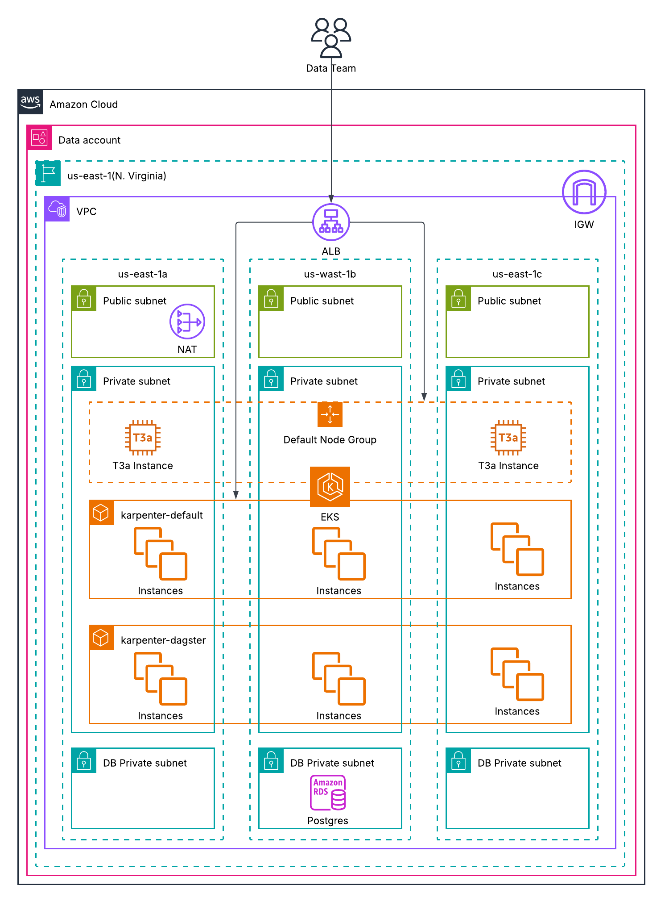

# Lab Test

This test was created keeping the following aspects in mind:
- Optimal evaluator experience, where you only need to run one command to deploy the entire stack
- Performance and Scalability
- Modular infrastructure
- Security best practices
- GitOps
- Automation

## Requirements
- Git
- AWS CLI(us-east-1)
- Credentials with administrative privileges(The test was developed using the AWS CLI integrated with AWS Identity Center)
- Terraform (v1.15+)
- Valid public domain on Route53 for the ALB ingress
- kubectl
- Docker

## Architecture Diagram


## Architecture Design & Decision Making

Terraform was chosen as the IaC tool, where mostly AWS terraform modules were used to deploy critical infrastructure components.

### Best practices adopted:
**Makefile for abstraction:** The Makefile abstracts the entire implementation, already considering the possibility for multiple environments without having to use tools like Terragrunt to maintain couple of environments. For this test specifically it also automates the docker build, push and git commit steps for better user experience.

**Variable validations:** Validations were implemented to ensure consistency and code reliability. This fail-fast approach prevents AWS API errors downstream (e.g., validating CIDR blocks) and provides user-friendly error messages.

**Terraform template files:** `templatefile` functions automate the ArgoCD manifest generation, ensuring the evaluator does not need to manually edit Helm values or repository URLs.

**Compute & Auto-scaling (Karpenter)**
Karpenter was selected over the traditional Cluster Autoscaler to provide rapid, intent-based, and group-less node provisioning. The cluster infrastructure relies on a two-tiered NodePool strategy configured for maximum performance and cost-efficiency:

1. **Data Workers (dagster-workers):** Dedicated strictly to Dagster workloads via NoSchedule taints. The pool dynamically provisions Spot and On-Demand instances restricted to compute, memory, and general-purpose families (c, m, r), exclusively targeting AWS generation 7 and 8 with AMD processors (e.g., C7a, R7a). This hardware mapping ensures access to the latest AMD EPYC architectures and DDR5 memory for optimal data processing.

2. **System Workloads (default):** Provisions highly cost-effective, burstable t3a instances designed solely to handle lightweight Kubernetes add-ons and other core cluster components.

3. **Optimization & Security:** All nodes are provisioned using Amazon Linux 2023 (AL2023) backed by encrypted 50Gi gp3 EBS volumes, ensuring modern security standards and consistent IOPS. An aggressive consolidation policy (WhenEmptyOrUnderutilized after 1 minute) ensures that temporary pipeline hardware is rapidly destroyed to minimize cloud costs.

**Container Optimization & Resiliency**
The custom Dagster application image (python:3.14-slim) is heavily optimized for Kubernetes environments:

1. **PID 1 Signal Handling:** Uses dumb-init as the entrypoint. When Karpenter scales down nodes, dumb-init intercepts the SIGTERM signal and passes it to Python, ensuring graceful pipeline shutdowns instead of abrupt SIGKILL terminations.

2. **Security Context:** The container runs entirely as a non-root user (UID 1000), natively matching the Kubernetes fsGroup constraints.

3. **Observability:** PYTHONUNBUFFERED=1 is injected to ensure logs stream instantly to the Dagster UI without being trapped in the language buffer.

**Zero Trust Security (Cognito)**
The Dagster UI is not publicly exposed. The AWS Load Balancer Controller is integrated with an AWS Cognito User Pool via Ingress annotations. This enforces a Zero Trust architecture, requiring authentication at the edge before any traffic reaches the Kubernetes cluster.

**Secrets Management & State Security (CSI Driver)**
The database master credentials are never stored in the Terraform state. By utilizing the RDS `manage_master_user_password` flag, AWS generates and manages the credential directly in AWS Secrets Manager. The Kubernetes workloads then retrieve this credential dynamically using the **AWS Secrets Store CSI Driver**, mounting it securely at runtime. This architecture eliminates the use of base64-encoded native Kubernetes Secrets and prevents credential leakage in Git or IaC state files.

**Event-Driven Alerting (AWS SNS)**
Instead of hardcoding SMTP servers or Slack webhooks directly inside the Dagster pipeline, AWS SNS (Simple Notification Service) was chosen for failure alerts. This provides a decoupled, event-driven architecture. A single failure event published to the SNS topic can easily "fan-out" to multiple subscribers (e.g., Email, SMS, PagerDuty via Lambda, or SQS queues) without requiring any modifications to the application code, offloading delivery reliability to a fully managed AWS service.

**Scope Focus: The Validation Pipeline**
The deployed Dagster pipeline is intentionally kept minimal (a "dummy" workflow). Since this assessment evaluates Cloud Platform Engineering and Infrastructure architecture, the pipeline's sole purpose is to act as an end-to-end infrastructure validator. It proves that:

1. The GraphQL API is accessible and responsive via the secure tunnel.
2. Dedicated worker nodes scale up dynamically via Karpenter tolerations.
3. The application can securely authenticate with external AWS services (SNS via IAM Roles for Service Accounts).
4. The Failure Sensor can successfully trigger event-driven architecture.
Complex data transformations were omitted to keep the evaluation focused strictly on platform resiliency, security, and GitOps automation.

**Future Roadmap: Observability & Incident Response**
For this lab, observability relies on native AWS CloudWatch. Deploying the full `kube-prometheus-stack` via ArgoCD was intentionally avoided, as it would consume unnecessary compute resources and increase deployment time just to monitor a dummy pipeline. This decision keeps the cluster lean and preserves the "one-click deploy" evaluator experience. 

For a production environment, the natural next step is migrating to AWS Managed Prometheus and Grafana for Kubernetes metric scraping. Additionally, the SNS alerting pipeline would be natively integrated with an Incident Management platform like **PagerDuty** via HTTPS webhooks, ensuring that critical pipeline failures automatically trigger on-call rotations, escalation policies, and incident tracking.

**Future Roadmap: Advanced Container Security**
To maintain the agility of this lab environment, Docker images are built and pushed with standard tags. However, in a strict production environment, the deployment strategy would incorporate two key Supply Chain Security enhancements:

1. **Vulnerability Scanning:** Integrating Trivy into the CI pipeline (and as an in-cluster operator) to block the deployment of images containing critical CVEs.

2. **Immutable Digests:** ArgoCD manifests would reference image digests (@sha256:...) instead of mutable tags (latest or v1.0). This guarantees deployment immutability and protects the cluster against image spoofing attacks.

## How to start?

1. Fork the test repository and clone it(SSH)
2. Create an S3 bucket.
3. Create `backend.tfvars` file containing the s3 backend configuration. This file should be located at `terraform/env/dev/vars/backend.tfvars` and have the following content:
```hcl
bucket  = "<BUCKET_NAME>"
key     = "dev/terraform.tfstate"
region  = "us-east-1"
encrypt = true
```

4. Export the AWS environment and AWS credentials(if applicable)
```bash
export AWS_PROFILE=your_profile
export ENV=dev
```

5. Change the necessary values on `terraform.tfvars` file according to your user and AWS account information. This file is located at `terraform/env/dev/vars/terraform.tfvars`.

6. Create all the necessary infrastructure with the following command:
```bash
make all
```

7. When the deployment is finished, you'll receive the cognito configuration as outputs. You'll need that to create a user to access the Dagster webserver

8. Create cognito user to access dagster. You need to inform the user_pool_id(Terraform Output) and the user password
```bash
aws cognito-idp admin-create-user --user-pool-id <USER_POOL_ID> --username hsat --message-action SUPPRESS --temporary-password "<PASSWORD>"

aws cognito-idp admin-set-user-password --user-pool-id <USER_POOL_ID> --username hsat --password "<PASSWORD>" --permanent
```

9. Confirm the SNS subscription on your email. This email might be on your SPAM folder.

10. Generate the kubeconfig for the EKS cluster
```bash
aws eks update-kubeconfig --name lab-cluster
```

11. Retrieve argocd password. The default user is `admin`
```bash
kubectl -n argocd get secret argocd-initial-admin-secret -o jsonpath="{.data.password}" | base64 -d; echo
```

12. After ~5 minutes the cluster components reconciliation loops already identified and applied the changes. You can access ArgoCD and Dagster Webserver at the following addresses:

- https://argocd.<DOMAIN>
- https://dagster.<DOMAIN>

## Running the dagster job
The public UI is secured with an AWS Cognito ALB Ingress (Zero Trust). To interact with the Dagster GraphQL API for automation, use a secure internal tunnel via port-forwarding.

1. Open a local tunnel to the Webserver pod:
```bash
kubectl port-forward svc/dagster-dagster-webserver 3000:80 -n dagster
```

2. Enable the SNS Alert Sensor:
```bash
curl -X POST http://localhost:3000/graphql \
  -H "Content-Type: application/json" \
  -d '{"query": "mutation { startSensor(sensorSelector: { repositoryLocationName: \"dummy-pipeline\", repositoryName: \"__repository__\", sensorName: \"sns_email_alert_sensor\" }) { __typename } }"}'
```

3. Trigger the Data Pipeline:
```bash
curl -X POST http://localhost:3000/graphql \
  -H "Content-Type: application/json" \
  -d '{"query": "mutation { launchRun(executionParams: { selector: { repositoryLocationName: \"dummy-pipeline\", repositoryName: \"__repository__\", jobName: \"dummy_sns_pipeline\" } }) { __typename } }"}'
```

## Teardown

To destroy the provisioned infrastructure, run the following command:
```bash
make destroy
```

### Known Limitations: Teardown Process
Due to the integration between Kubernetes controllers and AWS resources, you might encounter the following issues during the make destroy execution:

**ArgoCD Deletion Timeout:** The ArgoCD Helm release might hang and time out during deletion due to lingering Kubernetes finalizers holding the namespace.

**VPC Deletion Failure (ALB Dependency):** The AWS Load Balancer Controller dynamically provisions the Application Load Balancer and its associated Security Groups based on the Ingress resource. Because these components are created outside of Terraform's direct state tracking, Terraform will fail to delete the VPC on the first pass since the ALB's Security Groups are still attached to active ENIs.

### Workaround for clean up
- **ArgoCD:** Run `make destroy` again.
- **Public subnets:** Navigate to the AWS Console -> EC2 -> Load Balancers and delete the ALB associated with the cluster.
- **VPC:** Navigate to EC2 -> Security Groups and delete the security group created for the ALB. You can also delete the VPC via console as it will also delete the related Security Groups.
- Terraform will now successfully remove the remaining components.
